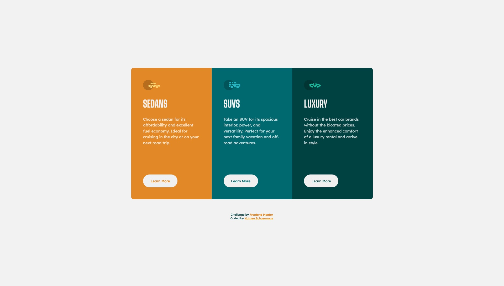

# Frontend Mentor - 3-column preview card component solution

This is a solution to the [3-column preview card component challenge on Frontend Mentor](https://www.frontendmentor.io/challenges/3column-preview-card-component-pH92eAR2-). Frontend Mentor challenges help you improve your coding skills by building realistic projects. 

## Table of contents

- [Overview](#overview)
  - [The challenge](#the-challenge)
  - [Screenshot](#screenshot)
  - [Links](#links)
- [My process](#my-process)
  - [Built with](#built-with)
  - [Continued development](#continued-development)
- [Author](#author)


## Overview

### The challenge

Users should be able to:

- View the optimal layout depending on their device's screen size
- See hover states for interactive elements

### Screenshot



### Links

- Solution URL: [Add solution URL here](https://your-solution-url.com)
- Live Site URL: [Add live site URL here](https://your-live-site-url.com)

## My process

### Built with

- (Semantic) HTML5 markup
- CSS custom properties
- Flexbox
- Mobile-first workflow

### What I learned

First finished project in 4 months. I needed something 'easy' to finish, but I did eventually end up going back and forth between small errors. I used Flexbox, since I am not yet comfortable with grid. 

I continued reading on css and html. As such I came across the ch, which I wanted to use. Eventhough it's a newbie-excercise and I'm a less new newbie I wanted to use some of the extra stuff I learned.
Putting a transparent-border on the button, was once a tip of ApplePieGiraffe.

```css
p {
  line-height: 1.5em;
  max-width: 45ch;
}
```

### Continued development

I'm currently going through the flexbox-tutorial series of Kevin Powell and will move on to Wes Bos' Grid afterwards. But I'm currently moving slowly due to work.

## Author

- Website - [Katrien S.](https://www.katriens.be)
- Frontend Mentor - [@graficdoctor](https://www.frontendmentor.io/profile/graficdoctor)
- Twitter - [@graficdoctor](https://www.twitter.com/graficdoctor)